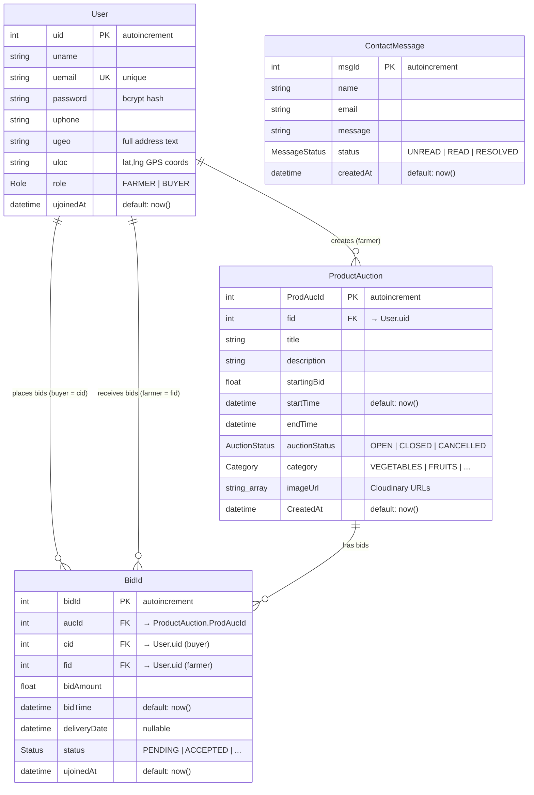

# 🗄️ DATABASE — Agri-Connect v2

> **Last updated:** 2026-07-26  
> **ORM:** Prisma 6.4.0  
> **Database:** PostgreSQL  
> **Schema file:** [`prisma/schema.prisma`](file:///home/critic-coder/project/AI_Assisted_Projects/agri-connect-v2/prisma/schema.prisma)

---

## 1. Entity-Relationship Diagram



---

## 2. Models (Tables)

### 2.1 `User`

The central identity model. Every user is either a **FARMER** (creates auctions) or a **BUYER** (places bids). The role is set at registration time.

| Column      | Type       | Constraints                  | Description                                 |
|-------------|------------|------------------------------|---------------------------------------------|
| `uid`       | `Int`      | `@id @default(autoincrement)` | Primary key                                 |
| `uname`     | `String`   | required                     | Display name                                |
| `uemail`    | `String`   | `@unique`                    | Login email (unique constraint)             |
| `password`  | `String`   | `@default("")`               | bcrypt-hashed password                      |
| `uphone`    | `String`   | `@default("")`               | Phone number (e.g. `+91 9876543210`)        |
| `ugeo`      | `String`   | required                     | Full-text address (street + state + pincode)|
| `uloc`      | `String`   | `@default("")`               | GPS coordinates as `"lat, lng"` string      |
| `role`      | `Role`     | `@default(FARMER)`           | Account type                                |
| `ujoinedAt` | `DateTime` | `@default(now())`            | Registration timestamp                      |

**Relations:**
- `bids_cid` → `BidId[]` — bids placed by this user (as buyer, via `cid`)
- `bids_fid` → `BidId[]` — bids received by this user (as farmer, via `fid`)
- `prod_fid` → `ProductAuction[]` — auctions created by this user (as farmer)

---

### 2.2 `ProductAuction`

A produce listing / auction. Created by a farmer, open for bids from buyers.

| Column          | Type            | Constraints                  | Description                                    |
|-----------------|-----------------|------------------------------|------------------------------------------------|
| `ProdAucId`     | `Int`           | `@id @default(autoincrement)` | Primary key                                    |
| `fid`           | `Int`           | FK → `User.uid`             | Farmer who created this auction                |
| `title`         | `String`        | required                     | Product name (e.g. "Organic Tomatoes (Bulk)")  |
| `description`   | `String`        | required                     | Free-text product description                  |
| `startingBid`   | `Float`         | required                     | Minimum bid amount in ₹                        |
| `startTime`     | `DateTime`      | `@default(now())`            | When the auction opens                         |
| `endTime`       | `DateTime`      | required                     | When the auction closes                        |
| `auctionStatus` | `AuctionStatus` | `@default(OPEN)`             | Current state of the auction                   |
| `category`      | `Category`      | `@default(OTHER)`            | Produce category                               |
| `imageUrl`      | `String[]`      | `@default([])`               | Array of Cloudinary image URLs (max 5)         |
| `CreatedAt`     | `DateTime`      | `@default(now())`            | Record creation timestamp                      |

**Relations:**
- `user_fid` → `User` — the farmer who owns this listing
- `auc_bid` → `BidId[]` — all bids placed on this auction

---

### 2.3 `BidId`

A bid placed by a buyer on a specific auction. The three-way relationship links a bid to an auction, a buyer, and a farmer.

| Column         | Type       | Constraints                  | Description                              |
|----------------|------------|------------------------------|------------------------------------------|
| `bidId`        | `Int`      | `@id @default(autoincrement)` | Primary key                              |
| `aucId`        | `Int`      | FK → `ProductAuction.ProdAucId` | Which auction this bid is for         |
| `cid`          | `Int`      | FK → `User.uid`             | Buyer (consumer) who placed the bid      |
| `fid`          | `Int`      | FK → `User.uid`             | Farmer who owns the auctioned product    |
| `bidAmount`    | `Float`    | required                     | Bid amount in ₹                          |
| `bidTime`      | `DateTime` | `@default(now())`            | When the bid was placed                  |
| `deliveryDate` | `DateTime?`| nullable                     | Expected delivery date (optional)        |
| `status`       | `Status`   | `@default(PENDING)`          | Bid lifecycle state                      |
| `ujoinedAt`    | `DateTime` | `@default(now())`            | Record creation timestamp (legacy name)  |

**Relations:**
- `user_cid` → `User` — the buyer
- `user_fid` → `User` — the farmer
- `auc_bid` → `ProductAuction` — the auction being bid on

**Business Logic:**
- When a farmer **accepts** a bid, all other `PENDING` bids on the same auction are auto-rejected, and the auction status is set to `CLOSED`.
- One buyer can place at most **one** bid per auction (enforced in the API route).

---

### 2.4 `ContactMessage`

Stores messages submitted through the public contact form. Not linked to any user account.

| Column      | Type            | Constraints                  | Description               |
|-------------|-----------------|------------------------------|---------------------------|
| `msgId`     | `Int`           | `@id @default(autoincrement)` | Primary key               |
| `name`      | `String`        | required                     | Sender's name             |
| `email`     | `String`        | required                     | Sender's email            |
| `message`   | `String`        | required                     | Message body              |
| `status`    | `MessageStatus` | `@default(UNREAD)`           | Read status for admin     |
| `createdAt` | `DateTime`      | `@default(now())`            | Submission timestamp      |

---

## 3. Enums

| Enum             | Values                                                       | Used In            |
|------------------|--------------------------------------------------------------|--------------------|
| `Role`           | `FARMER`, `BUYER`                                            | `User.role`        |
| `AuctionStatus`  | `OPEN`, `CLOSED`, `CANCELLED`                                | `ProductAuction.auctionStatus` |
| `Category`       | `VEGETABLES`, `FRUITS`, `GRAINS`, `DAIRY`, `MEAT`, `FISH`, `OTHER` | `ProductAuction.category` |
| `Status`         | `PENDING`, `ACCEPTED`, `REJECTED`, `COMPLETED`, `FAILED`    | `BidId.status`     |
| `MessageStatus`  | `UNREAD`, `READ`, `RESOLVED`                                | `ContactMessage.status` |

---

## 4. Relationships Summary

```
User ─────────── 1:N ──────────── ProductAuction     (via fid → uid)
User ─────────── 1:N ──────────── BidId              (as buyer, via cid → uid)
User ─────────── 1:N ──────────── BidId              (as farmer, via fid → uid)
ProductAuction ─ 1:N ──────────── BidId              (via aucId → ProdAucId)
ContactMessage ─ standalone ──── (no foreign keys)
```

### Foreign Key Constraints

All foreign keys use the Prisma defaults:
- **On Delete:** `RESTRICT` — prevents deletion of a user who has related bids or auctions.
- **On Update:** `CASCADE` — propagates UID changes (rare in practice with autoincrement).

---

## 5. Migration History

The schema evolved through **7 migrations** over Jan–Mar 2026:

| #  | Date       | Name                              | Changes                                                |
|----|------------|-----------------------------------|--------------------------------------------------------|
| 1  | 2026-01-23 | `init`                            | Created `User` table with `id`, `name`, `email`, `Role` enum |
| 2  | 2026-01-24 | `init` (v2)                       | Renamed columns (`uid`, `uname`, `uemail`), added `ugeo`, `uphone`, `ujoinedAt`. Created `ProductAuction`, `BidId`, `AuctionStatus`, `Category`, `Status` enums. Added foreign keys. |
| 3  | 2026-01-25 | `added_auc_id`                    | Added `aucId` FK column to `BidId` (linking bids to auctions) |
| 4  | 2026-01-28 | `image_url_update`                | Added `imageUrl` (TEXT) to `ProductAuction`            |
| 5  | 2026-03-15 | `migrationofuserpasswordandloc`   | Added `password` and `uloc` fields to `User`           |
| 6  | 2026-03-16 | `phtostr`                         | Changed `uphone` from `INTEGER` to `TEXT`              |
| 7  | 2026-03-25 | `make_image_url_array`            | Changed `imageUrl` from `TEXT` to `TEXT[]` array. Made `deliveryDate` nullable. Created `ContactMessage` table and `MessageStatus` enum. |

---

## 6. Seed Data

**File:** [`prisma/seed.ts`](file:///home/critic-coder/project/AI_Assisted_Projects/agri-connect-v2/prisma/seed.ts)

The seed script uses `@faker-js/faker` to populate the database with realistic test data:

| Entity           | Count | Details                                                          |
|------------------|-------|------------------------------------------------------------------|
| **Farmers**      | 15    | Random names, Karnataka districts, GPS coordinates in south India |
| **Buyers**       | 5     | Bengaluru-based, fixed GPS at `12.9716, 77.5946`                |
| **Products**     | 100   | Random titles, descriptions, categories. ~80% `OPEN`, ~20% `CLOSED`. LoremFlickr placeholder images. |
| **Bids**         | 50    | Random buyers bid on 50 random products with amounts above starting bid |

**Test credentials:** `farmer1@agriconnect.com` / `password123` (all seeded accounts share this password)

```bash
# Run the seed
npx prisma db seed
```

---

## 7. Database Access Layer

### Prisma Client Setup

**File:** [`lib/prisma.ts`](file:///home/critic-coder/project/AI_Assisted_Projects/agri-connect-v2/lib/prisma.ts)

A singleton pattern attaches the `PrismaClient` instance to the Node.js `global` object to prevent connection exhaustion during Next.js hot reloads in development:

```typescript
const globalForPrisma = global as unknown as { prisma: PrismaClient };
export const prisma = globalForPrisma.prisma || new PrismaClient();
if (process.env.NODE_ENV !== 'production') globalForPrisma.prisma = prisma;
```

### Generated Client Output

The Prisma client is generated to a custom path:

```
output = "../src/generated/prisma"
```

This is aliased in `tsconfig.json` as `@/generated/prisma`.

---

## 8. Query Patterns

### Common Read Queries

| Location                 | Query                                                    | Includes              |
|--------------------------|----------------------------------------------------------|-----------------------|
| Home page (marketplace)  | `productAuction.findMany({ where: { auctionStatus: 'OPEN' } })` | —                     |
| Product detail           | `productAuction.findUnique({ where: { ProdAucId } })`   | `user_fid` (farmer)   |
| Dashboard (farmer)       | `productAuction.findMany({ where: { fid: uid } })`      | `auc_bid.user_cid`    |
| Dashboard (buyer)        | `bidId.findMany({ where: { cid: uid } })`               | `auc_bid.user_fid`    |
| Search                   | `productAuction.findMany({ where: { OR: [title contains, description contains] } })` | — |
| Profile                  | `user.findUnique({ where: { uid } })`                   | —                     |

### Write Operations

| Operation         | Endpoint / Action       | Prisma Method                    |
|-------------------|-------------------------|----------------------------------|
| Register user     | `/auth/signupauth`      | `user.create`                    |
| Create auction    | `AucFormSubmit` action   | `productAuction.create`          |
| Place bid         | `/product/bid` route    | `bidId.create`                   |
| Accept bid        | `/api/bid` POST         | `bidId.update` + `bidId.updateMany` + `productAuction.update` |
| Reject bid        | `/api/bid` POST         | `bidId.update`                   |
| Update profile    | `/api/profileedit` PUT  | `user.update`                    |
| Contact message   | `/api/contact` POST     | `contactMessage.create`          |

---

## 9. Connection & Configuration

| Setting           | Value                                 |
|-------------------|---------------------------------------|
| **Provider**      | `postgresql`                          |
| **Connection URL**| `env("DATABASE_URL")`                 |
| **Client output** | `../src/generated/prisma`             |
| **Generator**     | `prisma-client-js`                    |

> [!IMPORTANT]
> The `DATABASE_URL` environment variable must be set in `.env` (local) or in the Vercel project settings (production). It is not committed to version control.
