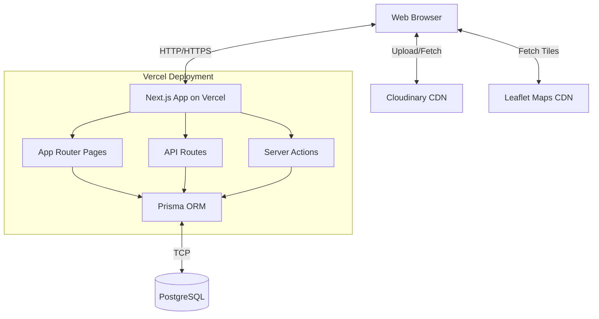
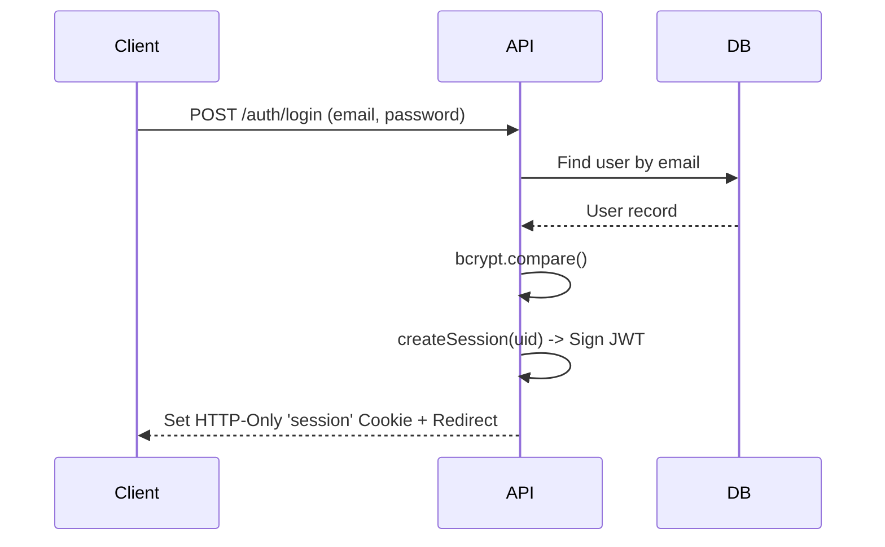

# 📐 Current Architecture Summary

This document outlines the current state of the Agri-Connect v2 application architecture.

## 1. System Overview

Agri-Connect v2 currently operates as a monolithic Next.js application deployed on Vercel. Frontend components, backend API routes, server actions, and database access logic are all housed within the same repository and deployment unit.

## 2. Tech Stack

| Technology | Version | Purpose |
| :--- | :--- | :--- |
| **Next.js** | 16.1.2 | Full-stack framework (App Router) |
| **React** | 19.2.3 | UI Library |
| **Tailwind CSS** | 4.x | Styling |
| **TypeScript** | 5.x | Language |
| **Prisma** | 6.4.0 | ORM |
| **PostgreSQL** | - | Primary Database |
| **jose** | - | Custom JWT Authentication |
| **bcrypt** | - | Password Hashing |
| **next-intl** | 4.7 | Internationalization (i18n) |
| **Leaflet & react-leaflet**| 1.9 & 5.0 | Maps and Geolocation |
| **next-cloudinary** | 6.17 | Image Uploads & Management |
| **date-fns** | 4.1 | Date formatting |
| **Vercel** | - | Hosting/Deployment |

## 3. Authentication Architecture

The application currently uses a custom JWT-based authentication system relying on `jose` and `bcrypt`. While NextAuth 5 beta is configured as a stub, it is not actively used.

**Flow:**
1. **Signup:** Client POST `/auth/signupauth/route.ts` ➔ Hash password (bcrypt) ➔ Create User in Prisma ➔ Sign JWT (`jose` HS256) ➔ Set HTTP-only cookie (`session`, 7d TTL) ➔ Redirect to `/`.
2. **Login:** Client POST `/auth/login/loginauth/route.ts` ➔ Find User ➔ Verify Password (bcrypt) ➔ Sign JWT ➔ Set HTTP-only cookie ➔ Redirect to `/`.
3. **Session Verification (Server):** `getUserSession()` decrypts the cookie and returns `{uid, uname}`.
4. **Session Verification (Client):** `SessionProvider` React context provides session data via the `useUser()` hook.
5. **Logout:** POST `/api/auth/logout` ➔ Delete cookie.

## 4. Routing Map

| Route Path | Type | Method | Auth Required? | Purpose |
| :--- | :--- | :--- | :--- | :--- |
| `/` | Page (CSR) | GET | No | Home/Marketplace. Fetches `/productsroute`. |
| `/auth/login` | Page (CSR) | GET | No | Login form. |
| `/auth/signup` | Page (CSR) | GET | No | Registration with role/location picker. |
| `/dashboard` | Page (SSR) | GET | Yes | Role-based dashboard (Farmer/Buyer views). |
| `/product?id=X` | Page (SSR) | GET | No | Product detail, bid form, map. |
| `/product/bid` | Page (CSR) | GET | Yes | Standalone bid form page. |
| `/productAuc` | Page (CSR) | GET | Yes (Farmer) | Create new auction listing. |
| `/search` | Page (SSR) | GET | No | Search by title/description. |
| `/profile` | Page (SSR) | GET | Yes | User profile view. |
| `/profile/edit` | Page (CSR) | GET | Yes | Profile edit form. |
| `/about` | Page (SSR) | GET | No | About page. |
| `/contact` | Page (CSR) | GET | No | Contact form. |
| `/productsroute` | API | GET | No (Issue) | Fetch all product auctions. |
| `/productListings`| API | POST | No (Issue) | Find product by ID + farmer data. |
| `/auth/login/loginauth` | API | POST | No | Login handler. |
| `/auth/signupauth` | API | POST | No | Registration handler. |
| `/api/auth/logout` | API | POST | Yes | Delete session cookie. |
| `/api/bid` | API | POST | Yes | Accept/reject bid actions. |
| `/product/bid` | API | POST | No (Issue) | Create new bid. |
| `/api/contact` | API | POST | No | Create ContactMessage. |
| `/api/profileedit`| API | PUT | Yes | Update user profile. |

## 5. Data Flow Patterns

1. **Server Components with Direct Prisma Access:** Pages like `/dashboard`, `/product`, `/search`, and `/profile` query the database directly during SSR.
2. **Client Components with fetch():** Pages like `/` use `fetch` calls to API routes (e.g., `/productsroute`).
3. **Server Actions:** Used for specific mutations, such as `AucFormSubmit` for creating product auctions.

## 6. Farmer Workflow

1. **Register:** Go to `/auth/signup`, choose FARMER role, pick GPS location on Leaflet map.
2. **Create Auction:** Go to `/productAuc`. Fill details (title, description, price, category, times) and upload up to 5 images via Cloudinary widget.
3. **Manage Bids:** Go to `/dashboard`. View listings and incoming bids sorted by amount descending.
4. **Accept/Reject:** Click Accept on a bid. This auto-rejects other pending bids and closes the auction.

## 7. Buyer Workflow

1. **Register:** Go to `/auth/signup`, choose BUYER role.
2. **Browse:** Browse the marketplace at `/` (shows OPEN auctions).
3. **View Details:** Click a product to view `/product?id=X` (images, description, map).
4. **Place Bid:** Submit bid via inline form (POST to `/product/bid`).
5. **Track Bids:** Go to `/dashboard` to view bid history and statuses (PENDING/ACCEPTED/REJECTED).

## 8. Bidding System

- Buyers place bids with an amount greater than the starting bid. Duplicate active bids by the same buyer on the same auction are blocked.
- Bids start in `PENDING` status.
- Farmers review bids. Upon clicking "Accept" via `/api/bid`, the selected bid becomes `ACCEPTED`, all other `PENDING` bids for that auction are marked `REJECTED`, and the auction status changes to `CLOSED`.

## 9. External Services

- **Cloudinary:** Active. Used for image hosting. Client-side upload widget is functional. Server-side SDK is configured but currently commented out.
- **Firebase:** Dormant. Initialized in `src/firebaseConfig.js` with hardcoded keys, but not utilized.
- **Leaflet:** Active. Used for mapping user locations and displaying proximity on product pages.
- **next-intl:** Active. Used for internationalization (English only at present).

## 10. Middleware

`proxy.ts` performs the following:
- Injects `x-current-path` header.
- Integrates the NextAuth stub middleware.
- Excludes specific paths (`api`, `_next/*`, `favicon.ico`) from processing.

## 11. Known Technical Debt

- **Security:** Firebase API keys are hardcoded in source code.
- **Security:** Missing authentication guards on `/productsroute`, `/productListings`, and `/product/bid` routes.
- **Bugs/Typos:** Typo `fontally` instead of `finally` in `BidForm.tsx`.
- **Code Quality:** Duplicate/unused routes (e.g., two login handlers, two signup handlers).
- **Code Quality:** Widespread use of `any` types in TypeScript.
- **Code Quality:** `bcrypt` uses `require()` instead of ES6 `import`.
- **Testing:** No automated tests exist.
- **Performance:** No pagination on product queries.
