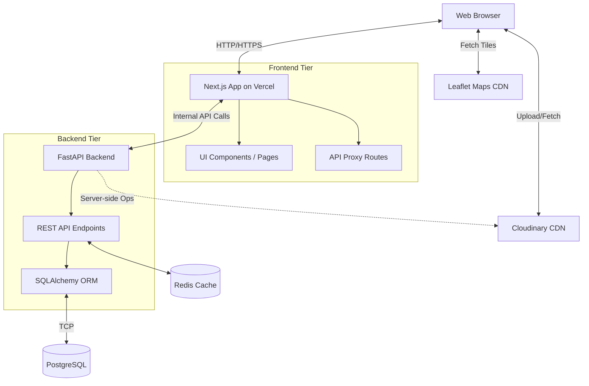
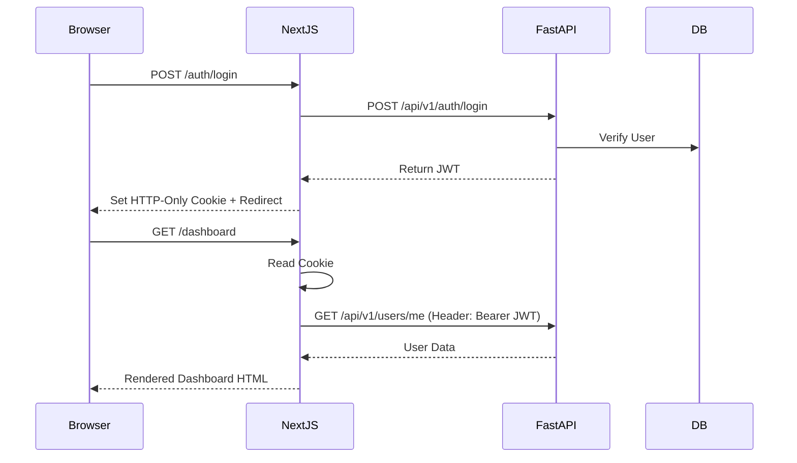
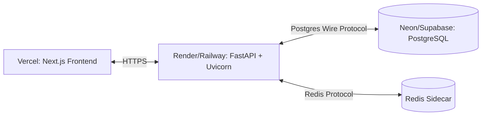

# 🏗️ Proposed Agri-Connect v2 Architecture

This document outlines the target architecture for Agri-Connect v2, migrating from a monolithic Next.js application to a decoupled architecture utilizing FastAPI for the backend.

## 1. Architecture Vision

The new architecture cleanly separates the frontend presentation layer from the backend business logic and database access.

## 2. Why FastAPI?

Migrating the backend to FastAPI provides several strategic advantages:
- **Type Safety & Validation:** Pydantic models ensure strict input validation and serialization.
- **Performance:** Built on Starlette, FastAPI offers excellent async I/O performance.
- **Developer Experience:** Auto-generated OpenAPI/Swagger documentation out of the box.
- **AI/ML Readiness:** Direct access to the Python data science ecosystem for future features like price prediction models or crop disease detection.
- **Separation of Concerns:** Decouples UI rendering from database access, allowing independent scaling and deployment.

## 3. Component Responsibilities

| Responsibility | Stays in Next.js | Moves to FastAPI |
| :--- | :---: | :---: |
| Page rendering (SSR/CSR) & Routing | ✅ | ❌ |
| UI Components, Tailwind CSS, Leaflet | ✅ | ❌ |
| Client-side form validation | ✅ | ❌ |
| i18n & Context (SessionProvider) | ✅ | ❌ |
| HTTP-only Cookie Management | ✅ | ❌ |
| Database Connection & Queries | ❌ | ✅ |
| JWT Issuance & Verification Core Logic | ❌ | ✅ |
| User, Auction, Bid, Contact CRUD | ❌ | ✅ |
| Business Logic (Auction closing, bid rules) | ❌ | ✅ |
| Image upload processing / DB storage | ❌ | ✅ |
| Future ML Models | ❌ | ✅ |

## 4. Authentication in the New Architecture

Authentication will span both services securely:
1. User logs in via Next.js. Next.js proxies credentials to FastAPI.
2. FastAPI validates credentials and issues a JWT.
3. Next.js receives the JWT and stores it in an HTTP-only cookie.
4. On subsequent requests, Next.js middleware extracts the JWT from the cookie and forwards it in the `Authorization` header to FastAPI.

## 5. API Communication Pattern

- **Server Components:** Make direct network requests to the FastAPI backend URLs.
- **Client Components:** Make requests to Next.js API Routes, which act strictly as reverse proxies, forwarding the request (and auth headers) to FastAPI. 
- **Security:** FastAPI is never exposed directly to the public web browser. All browser traffic goes through Next.js.

## 6. Database Migration Strategy

- **ORM Switch:** Migrate from Prisma to SQLAlchemy/Alembic in Python.
- **Database:** Keep the existing PostgreSQL database.
- **Schema:** Maintain the exact same tables and column structures initially to ensure a smooth transition.
- **Migrations:** Alembic will take over schema management. We will baseline Alembic to the current state of the database.

## 7. Deployment Topology

## 8. Key Design Decisions

1. **Keep Next.js for Frontend:** Next.js provides excellent React support, routing, and SSR capabilities, ensuring a fast, SEO-friendly marketplace.
2. **Move Logic to Python/FastAPI:** Prepares the platform for advanced data analytics and AI integration, which is critical for agricultural tech.
3. **Introduce Redis:** Used for session caching, rate limiting, and potentially caching heavy product catalog queries to improve marketplace performance.
4. **API Proxying:** Using Next.js API routes as proxies ensures we don't have to deal with complex CORS setups and keeps the backend URL hidden from the client.
5. **HTTP-only Cookies:** Maintained for security against XSS attacks, handled primarily by the Next.js edge.
